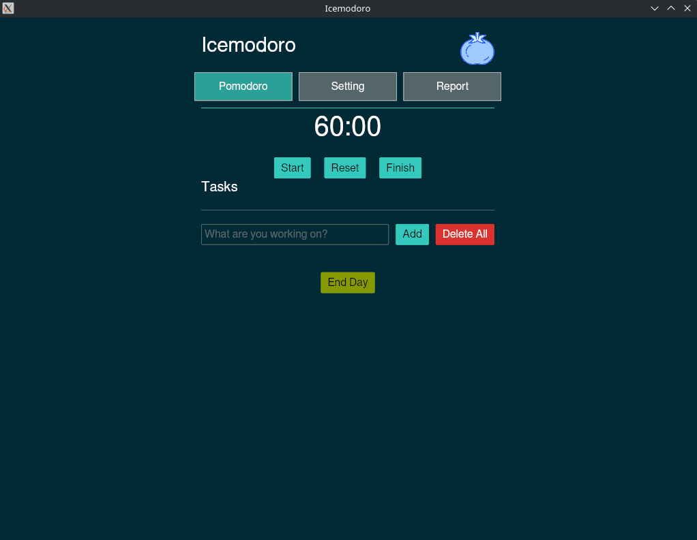

# Icemodoro
Pomodoro and ToDo application, inspired by [pomofocus.io](https://pomofocus.io/), using the Iced GUI library written in Rust.



## Features

- Pomodoro timer with customizable durations and themes
- Tasks, settings, and reports are saved automatically
- Tracks daily focused time, completed sessions, and calculates streaks
- Import/export functionality for report

## Installation

```bash
cargo run --release
```

For smaller, stripped binary:

```bash
cargo build --release
cargo strip
cargo run --release
```

## Shortcuts

| Key | Action |
| :--- | :--- |
| **Space** | Start/Stop timer |
| **r** | Reset timer |
| **f** | Finish session (skip to next) |
| **n** | Focus new task input |
| **a** | Activate/Deactivate first task |
| **↑ / ↓** | Navigate active task |
| **s** | Complete active task |
| **e** | Edit active task |
| **d** | Delete active task |
| **x** | End day (generates daily report) |
| **Tab** | Next tab |
| **Shift + Tab** | Previous tab |
